## Hi there 👋, Du_Cheng here

I'm a frontend developer at work, but full-stack at home :smile: Also a video uploader on bilibili.

### :camel: Languages and tools

 

### :rocket: Github Stats

  
  

### :four_leaf_clover: Workflows

### :bar_chart: My contribution graph

